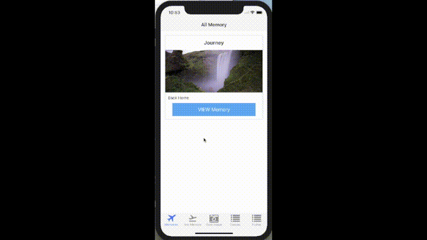

# Module 4 Group Assignment: Mobile Thing

CSCI 5117, Fall 2017, [assignment description](https://docs.google.com/document/d/1lYgnikooJgHZmLtAzKe1yTFgR7Czz9MGSXuQzl-s3R0)

## App Info:

* Team Name: val=n
* App Name: Memory
* App Link: <https://expo.io/@lakshyagoel/5117-rnpt>

### Students

* Lakshya Goel, goel0072@umn.edu
* Nishka Monteiro, monte299@umn.edu
* Akifumi Nakamachi, nakam052@umn.edu
* Vaybhav Shaw, shaw0162@umn.edu

## Key Features

* Allows to create Memories.
* Can save images from Camera Roll or take images to add to the memory.
* Can view the collection of images made with all the memories created.

## Screenshots of App

|Login|Item view|add new item|
|---|---|---|
||||

## External Dependencies

* react: To render the client
* react-native-elements: To use the card layout
* react-native-easy-toast: To show a message on Save
* react-native-form-generator: To create a form for entering the details. Doing npm install, this library would throw an error because of the pending PR <https://github.com/MichaelCereda/react-native-form-generator/pull/124>. We made the changes in the pull request on our local to make it work. Once this is done, npm install would not break the project.
* multer: sending data from client to sever
* request: controlling http?. Maybe default to express. But to prevent plagiarism, I write that
* mongoDB: To store the data
* mongooseJS: To develop schemas for mongoDB
* auth0: Authentication library for User Sign Up and Sign In
* passport: Authentication middleware for node
